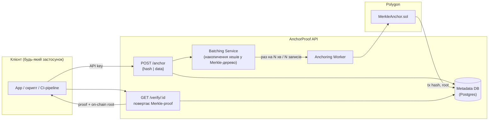
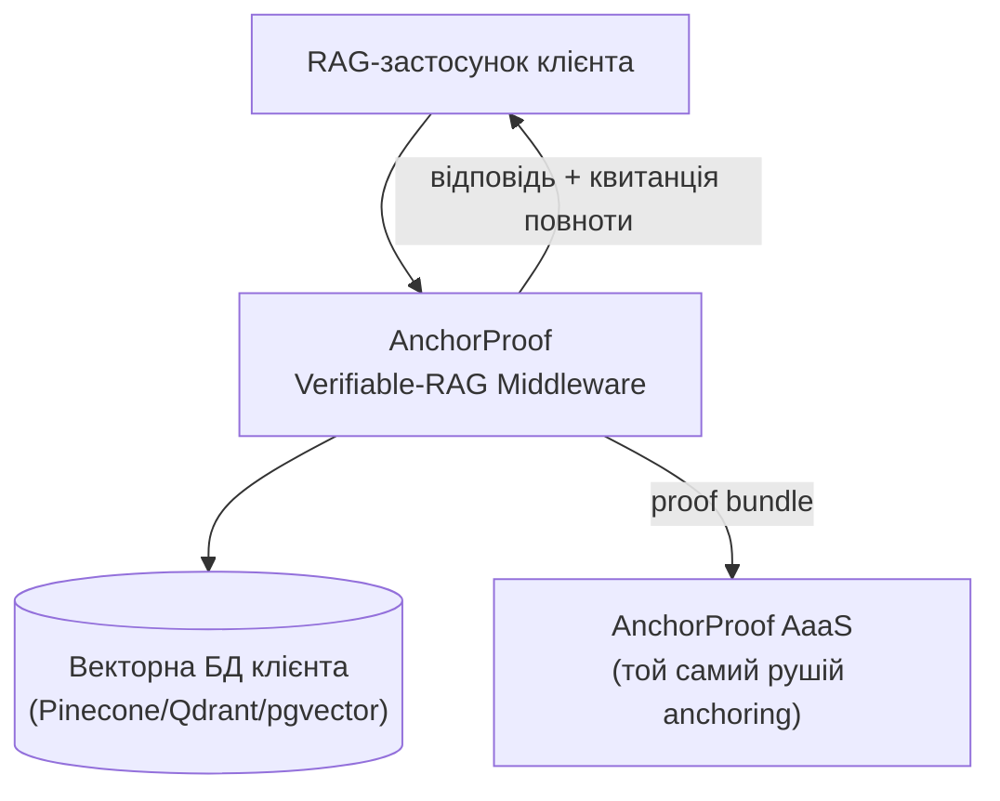
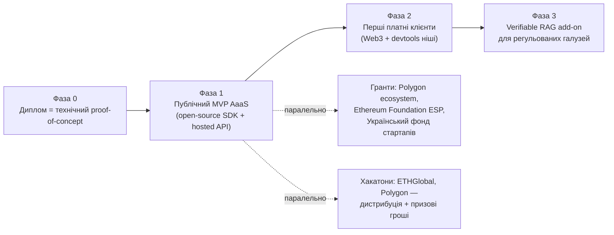

# Бізнес-ідея стартапу на основі теми диплому

**Working title:** *AnchorProof* (робоча назва, легко змінити)

**В одному реченні:** API, що перетворює будь-які дані (хеші документів,
корені векторних індексів, журнали AI-запитів) у незмінні, публічно
перевірювані записи в блокчейні Polygon — з опціональним криптографічним
доказом того, що семантичний пошук/AI-система нічого не приховала.

> Документ спирається на аналіз варіантів монетизації з `thesis-plan.md`
> (розділ 13). Обраний напрям: **Anchoring-as-a-Service як MVP** →
> **Verifiable RAG middleware як апгрейд для регульованих галузей**.
> Обґрунтування вибору — там-таки; тут — розгорнутий бізнес-план.

---

## 1. Проблема

1. **Компанії, що будують RAG/AI-продукти**, не можуть довести (собі,
   клієнту, регулятору), що система "бачила" всю релевантну інформацію
   перед тим, як згенерувати відповідь. Якщо вектор-провайдер прихований
   результат — ніхто цього не помітить.
2. **Будь-хто, кому потрібен immutable timestamp** (юристи, нотаріуси,
   дизайнери/автори для proof-of-authorship, аудитори логів, IoT-дані,
   supply chain) — платить за notarization або довіряє
   централізованому серверу, який теоретично можна підмінити заднім
   числом.
3. Існуючі рішення або **безкоштовні, але незручні** (OpenTimestamps —
   потрібен CLI/технічна інтеграція, немає SLA, немає API-платформи "під
   ключ"), або **дорогі enterprise-рішення** (Guardtime KSI — контракти
   від рівня уряду/великого банку, недоступні малому та середньому
   бізнесу).

**Ринкова щілина:** простий, дешевий, developer-friendly API "anchoring
за запитом" — від нього і будується компанія, а Verifiable-RAG-шар —
природний апгрейд для тих самих клієнтів, коли вони почнуть будувати AI.

---

## 2. Продукт

### 2.1 MVP — Anchoring-as-a-Service (AaaS)

**Що продається:** API-виклик `POST /anchor` → клієнт миттєво отримує
`receiptId`; за лаштунками сервіс батчить тисячі хешів в одне Merkle-дерево
й раз на кілька хвилин анкорить лише **один** корінь у Polygon (це і є
ключова інженерна перевага — вартість анкорування ділиться на всіх
клієнтів пакету). `GET /verify/:id` повертає Merkle-proof + посилання на
транзакцію в Polygonscan — будь-хто перевіряє незалежно, без довіри до
AnchorProof.

### 2.2 Апгрейд — Verifiable RAG Middleware

Той самий anchoring-рушій, але спеціалізований під вектори: SDK/проксі,
що інтегрується перед Pinecone/Qdrant/pgvector і до кожної RAG-відповіді
додає "криптографічну квитанцію" (набір Merkle-доказів + on-chain root),
що підтверджує повноту семантичного пошуку — це вже пряме перевикористання
наукового результату диплому (розділ 4-6 `thesis-plan.md`).

---

## 3. Бізнес-модель

| Рівень | Ціна (орієнтовно) | Що входить | Клієнт |
|---|---|---|---|
| **Free** | $0 | до 100 анкорів/міс, спільний батч (затримка до 1 год) | розробники, hobby-проєкти, пробний період |
| **Pro** | $49–99/міс | до 50k анкорів/міс, батч раз на 5 хв, dashboard, email-підтримка | стартапи, SaaS-команди |
| **Business** | $499+/міс | необмежені анкори, батч за запитом (near-real-time), SLA 99.9%, аудит-лог, SSO | компанії середнього розміру |
| **Verifiable RAG add-on** | від $999/міс або per-query fee | Merkle-квитанції повноти для RAG-запитів, compliance-звіти (EU AI Act) | юридичні/медичні/фінансові компанії |
| **Enterprise / on-prem** | за домовленістю | self-hosted anchoring worker, власний indexer-ключ, multisig | банки, держсектор |

**Модель доходу:** usage-based (кількість анкорів) + SaaS-підписка за
рівень сервісу, апсел на Verifiable RAG як окремий продукт для тих самих
акаунтів, коли вони почнуть впроваджувати AI.

---

## 4. Цільові сегменти (у порядку пріоритету виходу на ринок)

1. **Web3/крипто-розробники** — вже розуміють цінність anchoring, легко
   конвертуються, низький CAC (можна дістати через хакатони й Polygon
   ecosystem-канали).
2. **Devtools/SaaS-стартапи**, яким потрібен простий audit-trail (логи,
   події, підписи документів) без власної блокчейн-експертизи.
3. **RAG/AI-стартапи** — потенційний найбільший TAM, але довший цикл
   продажу; заходити через self-serve API, а не enterprise-sales.
4. **Регульовані галузі (legal/health/fintech)** — найвища willingness to
   pay, але вимагає компаєнс-сертифікацій і довшого циклу; це — Фаза 3.

---

## 5. Конкурентний ландшафт

| Гравець | Модель | Слабкість, яку ми використовуємо |
|---|---|---|
| OpenTimestamps | Безкоштовний, Bitcoin-anchoring | Немає API "під ключ", немає SLA/dashboard, незручний для non-crypto розробників |
| Chainpoint / Tierion | Схожа ідея, частково згорнутий проєкт | Ринок дозрів більше зараз (2026) через AI-compliance попит; можна зробити product-market fit точніше |
| Guardtime (KSI) | Enterprise-грейд blockchain-timestamping | Дорого, тільки для великих контрактів (уряди/банки) — ми беремо SMB/розробницький сегмент знизу |
| Власні "in-house" рішення компаній | Компанія сама пише hash-chain (як у поточному репозиторії — приклад!) | Дорого підтримувати, немає публічної перевірності — наш API дешевший і довірений за замовчуванням |

**Диференціація:** (1) developer-first API з батчингом "з коробки" —
дешевше за конкурентів на низьких обсягах; (2) єдиний рушій, що одночасно
продається як generic-anchoring і як спеціалізований Verifiable-RAG —
дві точки входу на ринок з одного технічного стеку.

---

## 6. Go-to-market

1. **Фаза 0 (0–6 міс, збігається з написанням диплому):** відкритий
   репозиторій, технічний блог-пост/стаття, деплой у Polygon Amoy testnet.
2. **Фаза 1 (місяць 4–8):** hosted API на mainnet, лендінг, self-serve
   реєстрація, Free/Pro тарифи. Дистрибуція — Hacker News, Product Hunt,
   Polygon Discord/форуми, ETHGlobal-хакатон як публічний дебют.
3. **Фаза 2 (місяць 6–12):** перші платні клієнти з Web3/devtools ніші;
   паралельно — заявка на грант (Polygon/ESP) для фінансування розробки
   без розмивання власності.
4. **Фаза 3 (рік 2):** Verifiable RAG add-on, перші pilot-проєкти з
   юридичними/медичними компаніями (можливо, через consulting-контракт
   спочатку, а не self-serve).

---

## 7. Технічний MVP-скоуп (що реально збудувати за 4–6 тижнів)

Прямо перевикористовує розділи 6 і 11 `thesis-plan.md`:

- `POST /anchor` (hash → receiptId), `GET /verify/:id` — REST API (NestJS,
  той самий фреймворк, що вже є в репозиторії).
- Batching worker (cron кожні 5 хв або поріг у 1000 записів).
- `MerkleAnchor.sol`, задеплоєний на Polygon Amoy → потім mainnet.
- Мінімальний dashboard (список анкорів, статус транзакції, посилання на
  Polygonscan).
- API-key автентифікація + Stripe для білінгу (usage-based).

**Що НЕ будувати на MVP:** multisig-управління indexer-ключем,
Verifiable-RAG middleware, compliance-звіти — це Фаза 3.

---

## 8. Фінансова прикидка (дуже приблизно, для ідеї, не для інвест-презентації)

| Стаття | Оцінка |
|---|---|
| Вартість анкорування (Polygon PoS, батч 1000 хешів/tx) | ~$0.001–0.01 за анкор при типовому gas price |
| Собівартість інфраструктури (hosting, DB) на старті | $20–50/міс (можна на Free-tier хмарних провайдерів) |
| Точка беззбитковості | ~10–20 Pro-підписників ($49–99/міс) |
| Найбільший фінансовий ризик | не витрати на blockchain, а customer acquisition cost у RAG/enterprise сегменті |

---

## 9. Ризики

| Ризик | Мітигація |
|---|---|
| Anchoring — комодитизована функція, легко скопіювати | Диференціюватись через UX/DX (API "під ключ") і через ексклюзивний Verifiable-RAG шар |
| Волатильність MATIC/gas price впливає на unit-економіку | Батчинг мінімізує вплив; можна виставляти ціну в USD, а gas абсорбувати в маржу |
| Довгий sales-цикл у регульованих галузях (Фаза 3) | Не будувати на цьому MVP-виручку; спочатку self-serve devtools-сегмент |
| Соло-засновник, обмежений час (паралельно диплом) | Максимально відкритий open-source MVP, гранти — щоб не залежати від власного часу на продажі |
| Регуляторна невизначеність щодо крипто в Україні/ЄС | Позиціонувати продукт як "SaaS з blockchain-бекендом", а не крипто-продукт; юридична консультація перед мільйонним обсягом транзакцій |

---

## 10. Зв'язок з дипломом

| Наукова частина диплому | Комерційна частина |
|---|---|
| Дерево Меркла над IVF-кластерами (розділ 3-5 `thesis-plan.md`) | Ядро Verifiable RAG add-on (Фаза 3) |
| Смарт-контракт `MerkleAnchor.sol` (розділ 6) | Ядро AaaS MVP (Фаза 1) |
| Модель загроз (розділ 8) | Маркетинговий наратив ("чому взагалі потрібен anchoring") |
| Метрики: gas cost, розмір proof, час верифікації (розділ 9) | Прямі вхідні дані для pricing-моделі (розділ 3 цього документа) |

Диплом де-факто **є** технічним due diligence для стартапу: наукова
новизна (completeness proof для ANN) — це і є майбутній моат Фази 3,
а не просто академічна вправа.

---

## 11. Наступні кроки

1. Зареєструвати робочу назву/домен (перевірити доступність, напр.
   `anchorproof.io` чи подібне — під час пошуку назви).
2. Задеплоїти `MerkleAnchor.sol` у Polygon Amoy testnet ще на етапі
   диплому — цей самий контракт стане основою MVP.
3. Скласти список 5–10 грантових програм із конкретними дедлайнами
   (Polygon ecosystem grants, ESP) і подати заявку паралельно з написанням
   диплому.
4. Знайти 2–3 потенційних design partners (Web3-команди чи devtools-стартапи)
   для безкоштовного пілоту MVP ще до публічного релізу — щоб перевірити
   попит до вкладення часу в білінг/dashboard.
