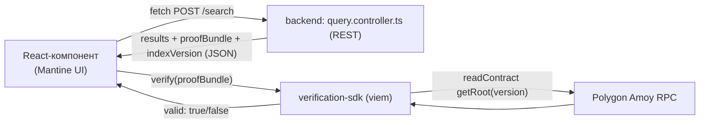

# Технологічний стек

Фіксація рішень щодо технологій для реалізації методу з `thesis-plan.md`.
Рішення враховують: (1) що вже реально є в репозиторії, (2) розробку на
Windows без WSL, (3) те, що частина коду (Merkle/IVF-протокол) — це сама
наукова новизна роботи, а не місце для чорних скриньок.

---

## 1. Зведена таблиця рішень

| Шар | Вибір | Альтернатива, яку відхилили | Причина відхилення |
|---|---|---|---|
| Мова/рантайм | TypeScript / Node.js | Python (для FAISS) | Поліглотний стек (Node + Python) додає складності інтеграції (HTTP/gRPC-міст) без реальної потреби |
| IVF-індекс | Власна реалізація на TS, центроїди — `ml-kmeans` | `faiss-node` (нативні C++ бінди) | На Windows нативна збірка (node-gyp) — постійне джерело проблем; FAISS — чорна скринька, а протоколу потрібен повний контроль над сортуванням кластера для range-proof |
| Дерево Меркла | Ручна реалізація + `js-sha3` (Keccak256) | `merkletreejs` | Готові бібліотеки дають лише inclusion-proof; range/non-membership proof повноти кластера — це і є наукова новизна, тож має бути прозорим власним кодом |
| Хеш-функція | Keccak256 | SHA-256 | Той самий хеш, що вбудований у EVM (`keccak256` у Solidity) — не потрібно два хеш-примітиви в різних шарах |
| Смарт-контракт тулінг | Hardhat | Foundry | Foundry вимагає більше налаштувань на Windows (типово через WSL); Hardhat — TS-native, ставиться напряму |
| Web3-бібліотека | viem | ethers.js | Сильніша TS-типізація "з коробки" (важливо для `verification-sdk` як окремого npm-пакета), pure-JS без нативних крипто-біндів, сучасний стандарт, добре працює з `@nomicfoundation/hardhat-toolbox-viem` |
| Мережа | Polygon Amoy (testnet) → Polygon PoS (mainnet) | Polygon zkEVM | PoS дешевший і простіший для MVP; zkEVM — можливий напрям подальших досліджень (розділ "Висновки" диплому) |
| Сховище | PostgreSQL (уже є, через Sequelize) | Нова БД / Milvus / Qdrant | Немає потреби піднімати окрему БД під масштаб диплому-прототипу; вектори й метадані кластерів зберігаються в тих самих таблицях |
| Векторне розширення | `pgvector` — опційно, лише для ground-truth в бенчмарках | Обов'язковий `pgvector` | Сам протокол не залежить від SQL-запитів до векторів — вся IVF-логіка в застосунку; `pgvector` потрібен лише щоб порахувати "чесний" recall@k для порівняння |
| Embeddings (демо-корпус) | `openai` (уже є в залежностях) | Власна embedding-модель | Немає сенсу тренувати/хостити модель заради самого диплому — беремо готове |
| Тести | Jest (уже налаштований) | Vitest / Mocha | Не змінювати те, що вже працює в `backend/` |
| Бенчмарки | окремі `ts-node`-скрипти (`benchmarks/`) | Jupyter/Python-ноутбуки | Залишаємось у TS-екосистемі, щоб не дублювати логіку IVF/Merkle другою мовою |
| API-шар | **REST-контролер** (NestJS `@Controller`) | GraphQL-резолвер (як у решті `backend/`) | Продукт з `startup-business-plan.md` (Anchoring-as-a-Service) — це зовнішній API для сторонніх розробників (`POST /anchor`, `GET /verify/:id`); REST простіше документувати (OpenAPI/curl-приклади) і продавати як API-продукт, ніж GraphQL. NestJS дозволяє REST-контролери й GraphQL-резолвери в одному застосунку одночасно — конфлікту з наявним `chatroom.resolver.ts` немає |
| Фронтенд | React 18 + Vite + TS 5.2 + Apollo Client + Mantine (уже є) | Новий окремий SPA/фреймворк | Демо верифікації — це просто ще один екран у наявному React-застосунку, окремий фронтенд не потрібен |

---

## 2. Структура пакетів і чому саме так

```
backend/
  src/verifiable-search/    # НОВИЙ модуль у наявному NestJS-застосунку
    ivf/
    merkle/
    query/
      query.controller.ts   # POST /search -> results + proofBundle (REST)
      query.service.ts
      query.dto.ts           # DTO для class-validator
contracts/                  # ОКРЕМИЙ пакет: Hardhat-проєкт
  MerkleAnchor.sol
  hardhat.config.ts
  package.json               # своя версія TS/hardhat
verification-sdk/           # ОКРЕМИЙ npm-пакет: клієнтська верифікація
  src/verify.ts
  package.json               # своя версія TS (>=5, вимога viem)
benchmarks/
  recall-eval.ts
  proof-size-eval.ts
  attack-simulation.ts
```

**Ключова технічна причина розділення на окремі пакети, а не один
монорепо-`package.json`:** `backend/` зараз сидить на **TypeScript 4.7.4**,
а `viem` вимагає **TypeScript ≥5**. Апгрейд TS у наявному backend —
ризикована окрема задача (можливі breaking changes у декораторах
NestJS/Sequelize), тому new-компоненти отримують власний, сучасний
tsconfig і не тягнуть за собою апгрейд усього застосунку.

`anchoring/`-сервіс усередині `backend/src/verifiable-search/` імпортує
`viem`-клієнт як залежність саме цього під-модуля (Node дозволяє різні
версії TS для транспіляції різних пакетів у монорепо — виконання все одно
відбувається на скомпільованому JS).

---

## 3. Конкретні нові залежності по пакетах

### `backend/` (додати до наявного `package.json`)
```
ml-kmeans        # вже є — перевикористовується для центроїдів IVF
js-sha3          # Keccak256 для Merkle-дерева, сумісний з EVM
```
*(FAISS/faiss-node навмисно НЕ додається — див. таблицю рішень)*

### `contracts/` (новий package.json)
```
hardhat
@nomicfoundation/hardhat-toolbox-viem
solidity ^0.8.24 (через hardhat)
typescript ^5.x
```

### `verification-sdk/` (новий package.json)
```
viem
js-sha3
typescript ^5.x
```

---

## 4. Версійні обмеження / на що звернути увагу при встановленні

- Node.js: 18+ (вимога `viem`/`hardhat-toolbox-viem`); наявний NestJS 9
  сумісний з Node 18, тож апгрейду Node не потрібно.
- `viem` і `hardhat` — чистий JS/TS, без нативних біндів → на Windows
  ставляться без node-gyp/Visual Studio Build Tools.
- `js-sha3` — теж pure-JS, без нативних залежностей.
- Якщо пізніше знадобиться `pgvector` — це розширення самого PostgreSQL
  (`CREATE EXTENSION vector;`), а не npm-пакет; на Windows зручніше через
  офіційний Docker-образ `pgvector/pgvector`, а не локальну збірку
  розширення.

---

## 5. Явно НЕ обрано (і чому)

| Технологія | Чому не береться на цьому етапі |
|---|---|
| FAISS (Python або `faiss-node`) | Нативні залежності на Windows + чорна скринька для структури кластера, потрібної для range-proof |
| Foundry | Гірший DX на Windows без WSL |
| ethers.js | viem дає сильнішу типізацію для SDK, який планується публікувати окремо |
| Milvus / Qdrant / Pinecone як основне сховище | Дублювало б власну IVF-реалізацію; ці системи керують кластеризацією самі, не даючи потрібного контролю над Merkle-структурою |
| Foundation-моделі для власних embeddings | Немає наукової цінності для теми диплому — важлива верифікація пошуку, а не якість embedding-моделі |

---

## 6. Інтеграція з фронтендом (React)

`frontend/` уже на **TypeScript 5.2.2** — конфлікту з `viem` (вимагає TS≥5)
немає, на відміну від `backend/`. Це означає, що `verification-sdk` можна
підключати у фронтенд напряму, без прошарків-обгорток.

**Потік даних для демо-екрана верифікації:**



- Запит і отримання `proofBundle` — звичайний `fetch`/`axios` до REST-ендпоінта нового модуля; наявний Apollo Client і далі обслуговує решту застосунку (чат, юзери) — два підходи до API співіснують в одному NestJS-застосунку без конфлікту.
- Сама криптографічна перевірка (перерахунок Merkle-коренів, звірка з on-chain root) виконується **на клієнті**, у браузері, через `verification-sdk` — принципово, бо весь сенс протоколу в тому, що верифікація не залежить від довіри до самого бекенду.
- UI-компоненти — Mantine (`@mantine/core`), як і решта інтерфейсу, щоб не вносити другу дизайн-систему заради одного екрана.

**Нова залежність у `frontend/package.json`:**
```
verification-sdk    # локальний workspace-пакет (не публікується під час диплому)
viem                 # транзитивно через verification-sdk, або напряму, якщо потрібен readContract у компоненті
```
*(окремий HTTP-клієнт не потрібен — вистачає нативного `fetch`, який уже підтримується Vite/браузером)*

---

## 7. Наступний крок

Після затвердження цього документа — скаффолдинг:
1. `contracts/` — `npx hardhat init` + перенесення ескізу `MerkleAnchor.sol` з `thesis-plan.md`.
2. `backend/src/verifiable-search/` — модуль NestJS з підмодулями `ivf/`, `merkle/`, `query/` (REST-контролер).
3. `verification-sdk/` — мінімальний пакет із заглушкою `verify()`.
4. Мінімальний React-екран у `frontend/` для демонстрації запиту + верифікації (Mantine + Apollo, за схемою з розділу 6).
