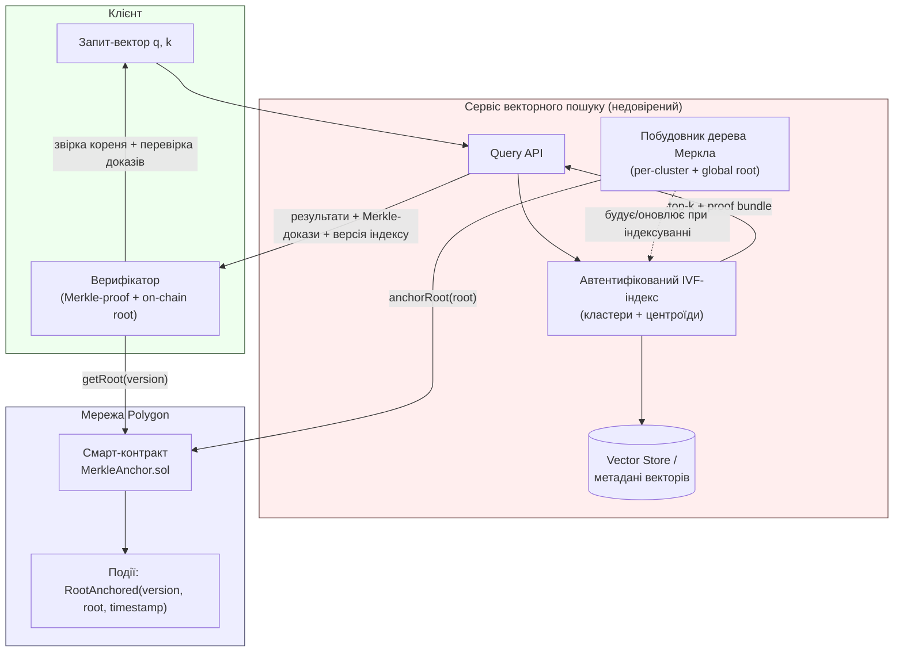
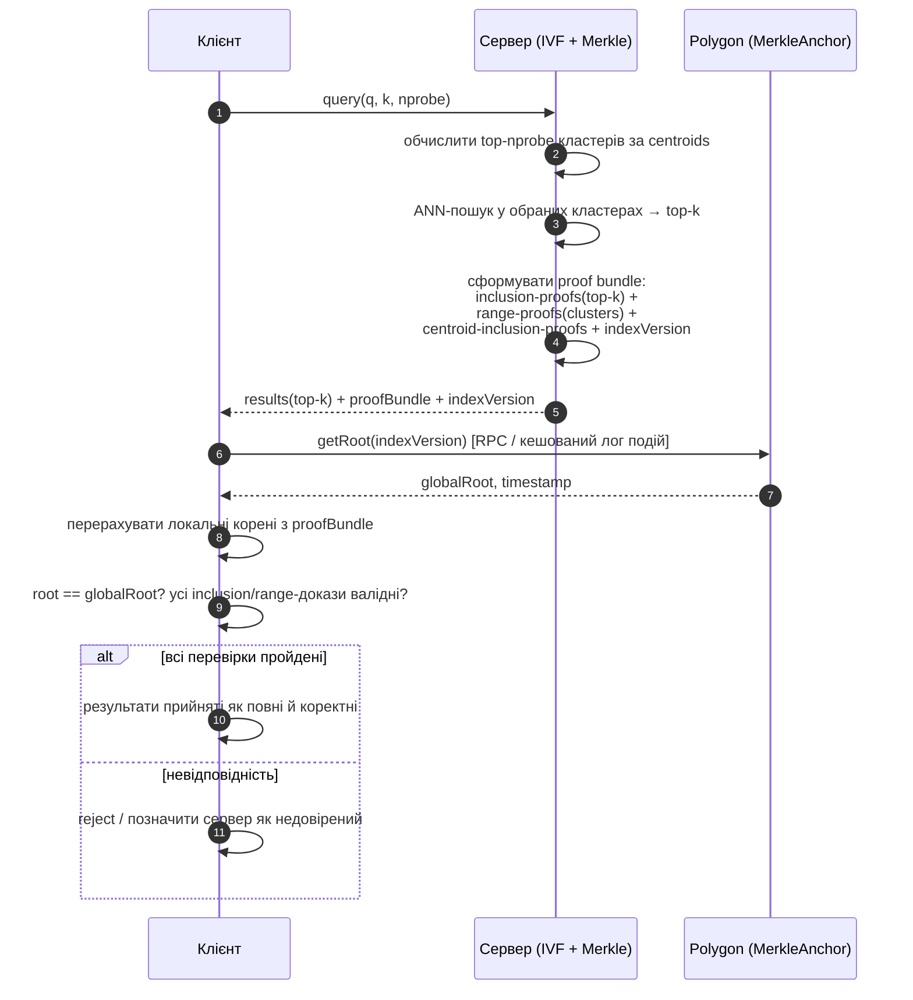
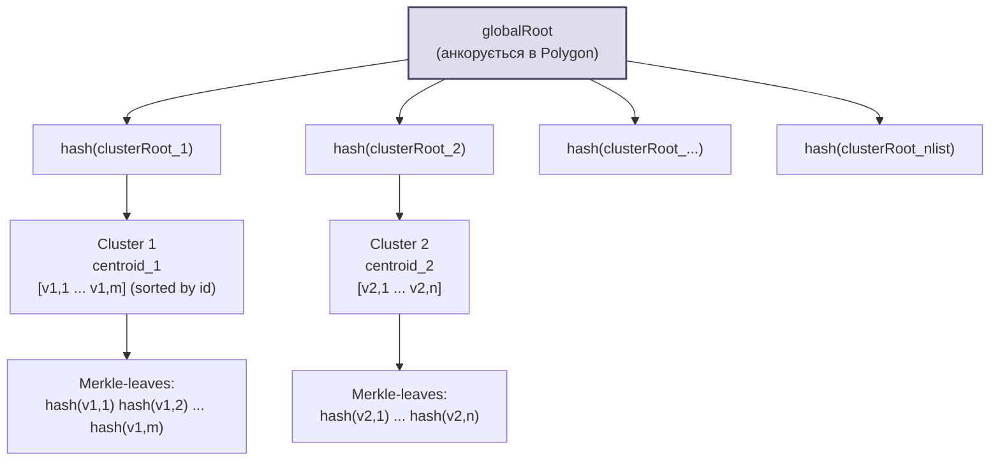
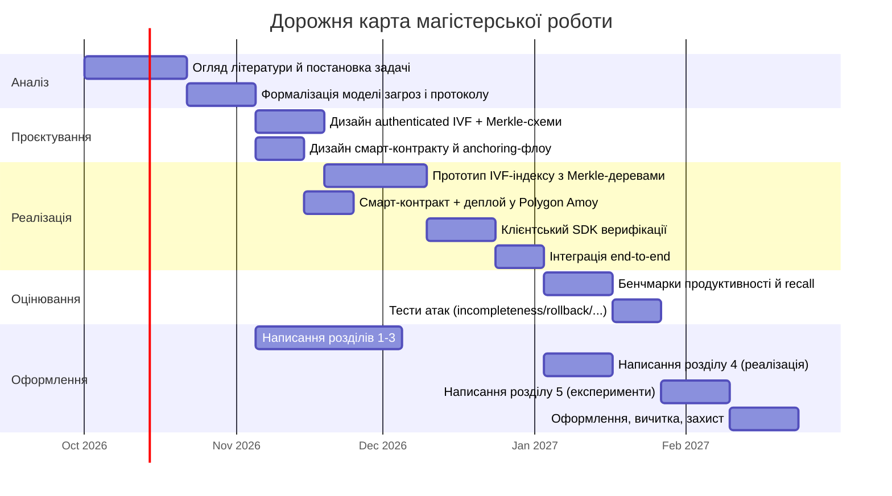
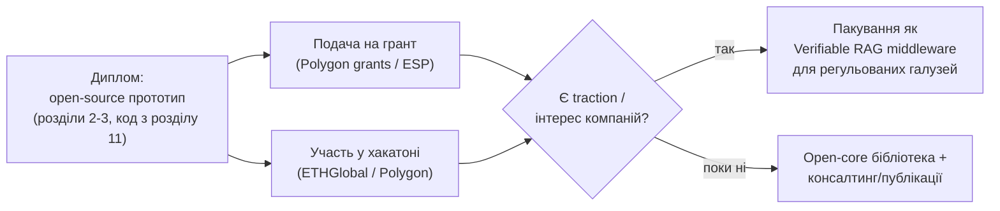

# План реалізації магістерської роботи

**Тема:** Удосконалення методу криптографічної верифікації повноти результатів
семантичного пошуку у векторних сховищах на основі автентифікованого
IVF-індексування, дерева Меркла та блокчейн-анкорування в мережі Polygon.

> Діаграми написані у форматі Mermaid — рендеряться нативно в GitHub, GitLab,
> Obsidian, VS Code (плагін Markdown Preview Mermaid Support) та більшості
> сучасних Markdown-переглядачів.

---

## 1. Постановка проблеми

Векторні сховища (Vector DB) виконують ANN-пошук (Approximate Nearest
Neighbor) через IVF, HNSW чи інші індекси. Клієнт надсилає запит і отримує
top-k найближчих векторів, але **не має способу перевірити**:

1. **Коректність (soundness)** — чи справді повернені вектори належать базі
   даних і чи правильно обчислені відстані;
2. **Повноту (completeness)** — чи не приховав сервер релевантніші вектори
   (найбільш небезпечний і малодосліджений випадок для ANN-індексів,
   оскільки "повнота" в ANN — поняття наближене, на відміну від точних
   B-tree/hash-запитів).

Довірений (trusted) векторний провайдер (SaaS RAG-сервіс, недовірений вузол
у децентралізованій мережі, аутсорсинг обчислень) може:
- зекономити ресурси, повернувши підмножину результатів (**incompleteness
  attack**);
- підмінити чи застарілу версію індексу (**staleness / rollback attack**);
- підробити вектори чи відстані (**correctness attack**).

**Мета роботи:** розробити метод, що дозволяє клієнту криптографічно
перевірити повноту й коректність top-k результатів семантичного пошуку без
повторного виконання пошуку на своїй стороні, використовуючи:

- **автентифіковане IVF-індексування** — кожен кластер (список
  інвертованого файлу) забезпечений автентифікованою структурою даних;
- **дерево Меркла** над кластерами/векторами для compact-доказів
  включення та діапазонних доказів повноти;
- **блокчейн-анкорування в Polygon** для незмінного, публічно
  перевірюваного commit до кореня дерева на момент побудови/оновлення
  індексу (захист від rollback і від нечесного сервера, що показує різним
  клієнтам різні версії індексу — equivocation attack).

---

## 2. Огляд суміжних робіт (для розділу "Аналіз літератури")

| Напрям | Що дає | Обмеження, які закриває ця робота |
|---|---|---|
| Authenticated Data Structures (Merkle tree, MHT, Merkle Patricia Trie) | Доказ включення/виключення елемента | Не адаптовані під ANN/IVF-кластеризацію |
| Verifiable KNN / Verifiable SQL (VeriKNN, GEM, Arx) | Доказ коректності top-k для точних метрик | Здебільшого точний пошук або низьковимірні дані, не масштабний semantic/ANN |
| Authenticated skip list / accumulators (RSA, bilinear) | Ефективні proof of non-membership | Дорогі при частих оновленнях індексу |
| Blockchain-anchored timestamping (OpenTimestamps, Chainpoint) | Незмінний timestamp кореня | Не прив'язані до структури ANN-індексу |
| Verifiable Vector Databases (нові 2023–2025 роботи) | Початкові підходи до verifiable ANN | Немає єдиної схеми "IVF + Merkle + L2-anchoring"; це і є новизна |

*Список — каркас для Розділу 1, детальні джерела студентка добирає окремо.*

---

## 3. Архітектура системи



**Компоненти:**

1. **Автентифікований IVF-індекс** — стандартний IVF (напр. на базі FAISS)
   доповнений тим, що кожен інвертований список (cluster) зберігається
   разом з упорядкованим (за id або відстанню до центроїда) масивом
   векторів, що дозволяє будувати над ним дерево Меркла та давати
   **діапазонні докази** (range proofs) "усі елементи кластера між i та j
   включені, нічого не пропущено".
2. **Побудовник дерева Меркла** — двошарова конструкція:
   - Merkle-дерево листків = хеші векторів (id + embedding + metadata)
     всередині одного кластера → `clusterRoot`;
   - Merkle-дерево другого рівня = хеші `clusterRoot` усіх кластерів →
     `globalRoot`.
3. **Anchoring-сервіс** — при кожному оновленні індексу (додавання
   документів, ребілд) обчислює новий `globalRoot` і надсилає транзакцію
   у смарт-контракт на Polygon.
4. **Смарт-контракт `MerkleAnchor.sol`** — зберігає мапу
   `version → (root, timestamp, blockNumber)`, емітить подію,
   дозволяє публічну звірку без довіри до сервера.
5. **Клієнтський верифікатор (SDK)** — бібліотека, що:
   - приймає результати пошуку + supporting proof bundle;
   - перераховує локально Merkle-корені й звіряє з тим, що читає з
     блокчейну (через RPC/публічний нод Polygon або кешований індексатор
     подій);
   - перевіряє **completeness-доказ** (розділ 4).

---

## 4. Ключовий протокол: доказ повноти (completeness proof)

Найскладніша науково-технічна частина роботи. Схема двоетапна:

### 4.1 Доказ "правильний набір кластерів був обраний"
Сервер повинен довести, що для запиту `q` він обрав `nprobe` кластерів із
найближчими до `q` центроїдами (а не довільні/невигідні для клієнта).
Підхід: центроїди теж включені у Merkle-дерево верхнього рівня; сервер
розкриває **відстані до всіх центроїдів** (їх небагато, O(nlist)), клієнт
перевіряє top-`nprobe` самостійно за розкритими (автентифікованими за
допомогою Merkle-доказів включення) значеннями центроїдів.

> **Застереження, яке варто явно прописати в тексті роботи** (рецензенти
> майже напевно про це спитають): повнота тут гарантується **відносно
> параметра `nprobe`** — тобто "нічого не приховано серед пробованих
> кластерів", а не відносно точного (exact) kNN по всій базі. Це властивість
> самого ANN/IVF-підходу, а не недолік протоколу: exact-повнота вимагала б
> перебору всіх `nlist` кластерів, що суперечить самій ідеї ANN. У розділі
> "Формальний аналіз безпеки" варто дати означення completeness саме як
> "recall-consistency відносно задекларованого `nprobe`" і показати, що для
> фіксованого `nprobe` результат детермінований і перевірний.

### 4.2 Доказ "усередині обраних кластерів нічого не приховано"
Для кожного обраного кластера сервер надає:
- Merkle-доказ включення (inclusion proof) для кожного з top-k
  фінальних кандидатів;
- **діапазонний доказ повноти**: кластер зберігається як відсортований
  масив (за id вектора), і сервер доводить, що клієнту показані *суміжні
  межі* масиву разом з двома "сусідніми" елементами, чиї хеші доводять,
  що між межами не existance іншого невключеного елемента (класична
  техніка Merkle range/non-membership proof, адаптована з authenticated
  skip lists).



---

## 5. Структура автентифікованого IVF-індексу



Кожен вектор-лист = `hash(id ∥ embedding ∥ metadata ∥ salt)`. Порядок
листків усередині кластера — за `id` (монотонний), що і уможливлює
range-proof "немає пропущеного елемента між сусідами".

---

## 6. Смарт-контракт (Polygon)

Мінімальний інтерфейс — навмисно простий, щоб мінімізувати gas cost
(головний практичний ризик роботи):

```solidity
// MerkleAnchor.sol (ескіз для розділу "Реалізація")
contract MerkleAnchor {
    struct Anchor {
        bytes32 root;
        uint64 timestamp;
    }

    mapping(uint256 => Anchor) public anchors; // version => Anchor
    uint256 public latestVersion;
    address public indexer; // адреса, якій дозволено анкорити

    event RootAnchored(uint256 indexed version, bytes32 root, uint64 timestamp);

    modifier onlyIndexer() {
        require(msg.sender == indexer, "not authorized");
        _;
    }

    function anchorRoot(bytes32 root) external onlyIndexer {
        latestVersion += 1;
        anchors[latestVersion] = Anchor(root, uint64(block.timestamp));
        emit RootAnchored(latestVersion, root, uint64(block.timestamp));
    }

    function getRoot(uint256 version) external view returns (bytes32, uint64) {
        Anchor memory a = anchors[version];
        return (a.root, a.timestamp);
    }
}
```

**Проєктні рішення, які треба обґрунтувати в роботі:**
- Polygon PoS (дешевий gas, ~2с блок) vs Polygon zkEVM — обрати й
  аргументувати вибір мережі/тестнету (Amoy testnet для експериментів).
- Частота анкорення (batch): не після кожного вектора, а після
  батчу оновлень/за розкладом — trade-off "свіжість vs вартість газу".
- Хто має право анкорити (`onlyIndexer`) — модель довіри: індексатор
  довірений щодо *свіжості*, але не щодо *повноти відповіді* (це і
  перевіряє протокол розділу 4).

---

## 7. Технологічний стек (пропозиція)

| Шар | Технологія | Примітка |
|---|---|---|
| Векторний індекс | FAISS (IVF-Flat/IVF-PQ) через Python-сервіс або `faiss-node` | база для модифікації під authenticated-структуру |
| Backend/API | Node.js + NestJS (уже є каркас у `backend/`) | новий модуль, окремий від чат-функціоналу |
| Криптографія / Merkle | `merkletreejs` / власна реалізація (SHA-256 або Keccak256 для сумісності з EVM) | Keccak256 зручний, бо той самий, що й у Solidity |
| Смарт-контракт | Solidity + Hardhat/Foundry | тестнет Polygon Amoy |
| Web3-інтеграція | ethers.js / viem | читання подій, надсилання анкор-транзакцій |
| Клієнтський SDK верифікації | TypeScript-бібліотека (окремий пакет) | незалежна від сервера для чесності експерименту |
| Бенчмарк/датасети | SIFT1M / GloVe / власний embedding-корпус (напр. на базі sentence-transformers) | для вимірювання recall, overhead |

> Наявний у репозиторії `backend/src/blockchain/*` — це навчальний
> proof-of-work хеш-ланцюжок для чат-повідомлень (без дерева Меркла, без
> реального блокчейну). Для нової теми він **не перевикористовується
> напряму** (інша модель загроз і інша структура даних), але ідею
> "хешованого ланцюжка блоків" і код роботи з хешами можна взяти за
> відправну точку.

---

## 8. Модель загроз (Threat Model) — короткий каркас розділу

| Атака | Хто виконує | Що детектує метод |
|---|---|---|
| Incompleteness (приховування релевантних векторів) | недовірений сервер | range-proof повноти кластера |
| Tampering (підміна embedding/metadata) | недовірений сервер / MITM | inclusion-proof + hash mismatch |
| Rollback (показ застарілої версії індексу) | недовірений сервер | звірка `indexVersion` з `latestVersion` on-chain |
| Equivocation (різним клієнтам — різні "правди") | недовірений сервер | публічність `globalRoot` в блокчейні — усі бачать один корінь |
| Fake centroid selection (невигідний nprobe) | недовірений сервер | розкриття й перевірка відстаней до всіх центроїдів |

---

## 9. Метрики оцінювання (для експериментального розділу)

- **Recall@k** до/після автентифікації (перевірка, що метод не псує якість ANN);
- **Overhead побудови індексу**: час/пам'ять на побудову Merkle-дерев відносно "голого" FAISS IVF;
- **Розмір proof bundle** (байти) залежно від `nprobe`, розміру кластера, k;
- **Час верифікації на клієнті** (має бути << часу повторного пошуку);
- **Gas cost анкорення** та вартість у MATIC/USD за різної частоти батчів;
- **Затримка "до фіналізації"** (time-to-finality) Polygon і вплив на UX;
- **Стійкість до симульованих атак** (штучно вирізані результати — чи метод їх детектує в 100% випадків).

---

## 10. Дорожня карта робіт



*Дати умовні (старт 1 жовтня 2026) — підставити реальні дедлайни кафедри.*

---

## 11. Пропонована структура коду (новий модуль у репозиторії)

```
backend/
  src/
    verifiable-search/
      ivf/
        cluster.ts              # структура кластера, сортування за id
        ivf-index.service.ts    # побудова/оновлення IVF, підбір nprobe
      merkle/
        merkle-tree.ts          # генерик Merkle-дерево (Keccak256)
        cluster-tree.builder.ts # clusterRoot + globalRoot
        proof.types.ts          # InclusionProof, RangeProof, CentroidProof
      anchoring/
        anchoring.service.ts    # виклик смарт-контракту при ребілді
        polygon.provider.ts     # ethers/viem-клієнт до Polygon Amoy
      query/
        query.controller.ts     # POST /search -> results + proofBundle (REST)
        query.service.ts
contracts/
  MerkleAnchor.sol
  test/MerkleAnchor.test.ts
verification-sdk/
  src/
    verify.ts                   # клієнтська перевірка (незалежний пакет)
  test/
benchmarks/
  recall-eval.ts
  proof-size-eval.ts
  attack-simulation.ts
```

---

## 12. Ризики та мітигації

| Ризик | Вплив | Мітигація |
|---|---|---|
| Gas-витрати анкорення при частих оновленнях | Вартість / масштабованість | Батчинг анкорів, off-chain агрегація, вибір Polygon PoS (низький gas) |
| Range-proof ускладнює додавання нових векторів (треба re-sort кластера) | Складність підтримки індексу | Періодичний rebuild + append-buffer з окремим "неавтентифікованим" hot-tier, що зливається під час rebuild |
| Розмір proof bundle зростає з розміром кластера | UX/мережа | Обмежити розмір кластера (nlist), стиснення доказів, часткове розкриття |
| Довіра до `indexer`-адреси смарт-контракту | Централізація anchoring | Явно задекларувати як межу моделі довіри роботи; за потреби — multisig |
| Складність формальної симуляції атак | Достовірність результатів | Розробити окремий attack-injection harness (п.9) із детермінованими сценаріями |

---

## 13. Монетизація та комерціалізація (поза межами диплому, для розвитку теми)

Тема лежить на перетині двох "гарячих" напрямів — RAG/векторні БД і
перевірювані обчислення (verifiable computing), що дає кілька реалістичних
шляхів виходу за межі суто академічної роботи.

### 13.1 Варіанти монетизації

| # | Модель | Суть | Цільова аудиторія | Готовність з диплому |
|---|---|---|---|---|
| 1 | **Open-core бібліотека** | Безкоштовний плагін до FAISS/Qdrant/pgvector (ядро з розділу 11); платно — дашборд аудиту, SLA, managed-anchoring, підтримка | Інфраструктурні/DevTools-команди | Найближче: ядро = прототип диплому |
| 2 | **Verifiable RAG middleware (SaaS)** | Проксі між LLM-застосунком і vector DB, що додає до кожної відповіді "криптографічну квитанцію": з яких документів зібрано, що нічого не відфільтровано | Юридичні, медичні, фінансові компанії | Потребує обгортки над прототипом + UI |
| 3 | **AI-комплаєнс і аудит** | Незмінний анкорований журнал пошукових запитів як compliance-модуль | Компанії під EU AI Act; релевантно й для євроінтеграції України | Потребує compliance-звітності поверх anchoring-сервісу |
| 4 | **Anchoring-as-a-Service** | Окремий простий продукт: API, що приймає хеші, батчить і фіксує в Polygon; оплата за кількість анкорів | Будь-хто, кому потрібен immutable timestamping (не лише vector DB) | Це вже є як компонент у розділі 6 — можна виокремити |
| 5 | **Web3-ніша** | Децентралізовані data-маркетплейси й AI-мережі без взаємної довіри між вузлами | Web3/DeFi/decentralized-AI проєкти | Природне продовження моделі загроз розділу 8 |
| 6 | **Гранти** (найшвидший старт) | Polygon ecosystem grants, Ethereum Foundation ESP, Український фонд стартапів, EIC/Horizon Europe | Грантодавці open-source Web3-інфраструктури | Тема підходить майже ідеально — open-source + публічний блокчейн |
| 7 | **Наука/консалтинг** | Публікація на профільній конференції, хакатони (Polygon, ETHGlobal — часто є призові треки), консалтинг для RAG-команд | Наукова спільнота, компанії, що будують RAG | Прямий побічний продукт написання диплому |

### 13.2 Реалістична послідовність



Патентування алгоритмічної частини — теоретично можливе, але для
криптографічних протоколів зазвичай дороге відносно віддачі; пріоритет —
open-source + грант, а не патент.

### 13.3 Що це означає для плану диплому

- Розділ 11 (структура коду) варто з самого початку писати як
  **окремий пакет** (`verification-sdk`, `contracts/`), а не намертво
  вшитий у `backend/` — це прямо потрібно і для open-core розповсюдження,
  і для подачі на грант/хакатон.
- Ліцензію одразу обрати permissive (MIT/Apache-2.0) для open-core моделі.
- У висновках диплому (розділ "Практичне значення") явно згадати можливі
  напрями застосування з таблиці 13.1 — це підсилює й академічну оцінку
  роботи, і дає готовий текст для майбутньої грантової заявки.

---

## 14. Наступні кроки

1. Затвердити тему й цей план з керівником.
2. Уточнити джерела для розділу "Аналіз літератури" (п. 2).
3. Обрати конкретний датасет для експериментів (SIFT1M / власний корпус).
4. Почати з мінімального вертикального зрізу: один кластер → один
   Merkle-доказ → одне анкорення в Polygon Amoy testnet — щоб перевірити
   архітектуру end-to-end до масштабування.
